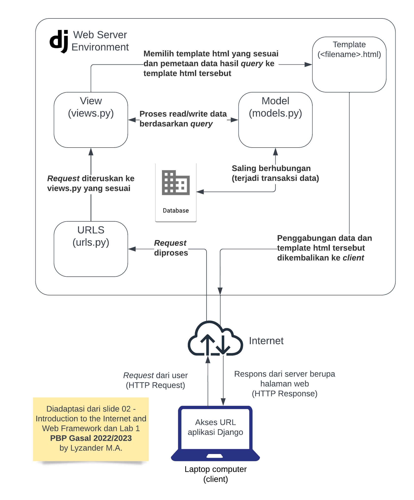
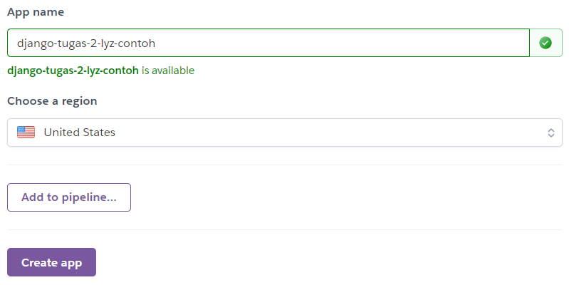

# Aplikasi Katalog Django
:link: [Aplikasi Katalog](https://django-tugas-2-lyz.herokuapp.com/katalog/)
## Konsep Model, View, dan Template 

***

## Virtual Environment
[*Virtual Enviroment*](https://docs.python.org/3/library/venv.html#:~:text=A%20virtual%20environment%20is%20a,part%20of%20your%20operating%20system.) pada Python adalah Python *environment* sedemikian hingga Python interpreter, libraries, dan scripts yang di-*install* pada proyek kita akan terisolasi dari *virtual environment* lainnya dan juga *libraries* yang ter-*install* pada "system" Python. Tujuan Penggunaan *virtual environment* pada proyek Django adalah untuk memisahkan pengaturan dan mengisolasi *package/dependencies* yang di-*install* pada setiap proyek Django sehingga proyek Django lainnya tidak terpengaruh ketika suatu perubahan dilakukan pada proyek Django tertentu. Oleh karena itu, setiap proyek Django yang kita kembangkan disarankan memiliki *virtual environment*.

> Perhatikan bahwa kita tetap dapat membuat aplikasi web berbasis Django tanpa menggunakan *virtual environment*. Namun, hal ini tidak disarankan karena versi dari *package/dependencies* yang dibutuhkan untuk proyek Django tersebut bisa bertabrakan dengan versi yang telah ter-*install* pada "system" Python.

> TL; DR *Virtual environment* dimanfaatkan agar tidak ada konflik antara *requirements* pada proyek Django kita dengan *requirements* dari proyek Django lainnya maupun dengan *libraries* yang telah ter-*install* pada "sistem" Python. 
***

## Implementasi
1. Pembuatan Fungsi pada `views.py`<br>
Tujuan pembuatan fungsi pada `views.py` adalah agar dapat melakukan pengambilan data dari model dan dikembalikan ke sebuah HTML. Implementasi dilakukan dengan import class `CatalogItem` dari `models.py` yang terdapat pada folder *project* `katalog` ke `views.py` pada folder yang sama. Class `CatalogItem` digunakan untuk melakukan pengambilan data dari *database*. Instruksi berupa

    ```python
    from katalog.models import CatalogItem 
    ```
    Kemudian, sebuah fungsi didefinisikan pada `views.py` berupa `show_katalog(request)` dengan paramater request. Hal ini bertujuan untuk memproses permintaan yang masuk.

    ```python
    def show_katalog(request):
        data_katalog = CatalogItem.objects.all()
        context = {
            'list_item': data_katalog,
            'nama': 'Lyzander Marciano Andrylie',
            'id': '2106750755',
        }

        return render(request, "katalog.html", context)
    ```

    `data_katalog = CatalogItem.objects.all()` bertujuan untuk memanggil fungsi *query* ke *model database* dan menyimpan hasil *query* yang dikembalikan (dalam bentuk QuerySet) ke variabel `data_katalog`.

    Kemudian, data yang ada pada variabel `context` akan di-*render* oleh Django sehingga data tersebut dapat diakses pada halaman HTML pada `katalog.html`.

2. Pembuatan *Routing*<br>
Tujuan pembuatan sebuah *routing* adalah untuk memetakan fungsi yang telah dibuat pada `views.py`. Hal ini dikarenakan permintaan yang masuk ke dalam server Django akan diproses melalui `urls` dan kemudian diteruskan ke `views` yang sesuai dan telah didefinisikan.

    Implementasi dilakukan dengan mendaftarkan aplikasi `katalog` ke dalam `urls.py` pada `project_django` dengan menambahkan `path('katalog/', include('katalog.urls')),` pada variabel `urlpatterns`. Selanjutnya, kita lakukan konfigurasi pada `urls.py` pada folder *project* `katalog` sebagai berikut.

    ```python
    from django.urls import path
    from katalog.views import show_katalog

    app_name = 'katalog'

    urlpatterns = [
        path('', show_katalog, name='show_katalog'),
    ]
    ```

    > Perhatikan bahwa kita harus import fungsi `show_katalog` dari `views.py` pada folder *project* `katalog` ke `urls.py` tersebut untuk memetakan (*routing*) fungsi tersebut. 

3. Pemetaan Data ke `katalog.html`<br>
Tujuan Pemetaan data ke dalam HTML dengan sintaks dari Django untuk pemetaan data template adalah agar data dapat ditampilkan pada HTML tersebut. 

    implementasi dilakukan dengan memanfaatkan sintaks khusus *template* pada Django, sepeti `{{nama}}`, `{{id}}`. Selain itu, untuk menampilkan daftar *item* ke dalam tabel, iterasi harus dilakukan pada `list_item`. Perhatikan bahwa `list_item` memiliki *value* berupa `QuerySet` yang berisi objek. Oleh karena itu, untuk mendapatkan data dari masing-masing objek, pemanggilan dot (.) harus digunakan untuk memanggil *attribute/data field*.

    ```html
    ...
    <h5>Name: </h5>
    <p>{{nama}}</p>

    <h5>Student ID: </h5>
    <p>{{id}}</p>
    ...
    
    <tr>
      <th>{{item.item_name}}</th>
      <th>{{item.item_price}}</th>
      <th>{{item.item_stock}}</th>
      <th>{{item.rating}}</th>
      <th>{{item.description}}</th>
      <th>{{item.item_url}}</th>
    </tr>
    
    ...
    ```

    Selain itu, kita harus melakukan perintah `python manage.py makemigrations` untuk mempersiapkan migrasi skema model dan `python manage.py migrate` untuk menerapkan skema model yang telah dibuat ke dalam *database* Django lokal.

4. Deploy Aplikasi Django ke HeroKu<br>
*Deployment* ke HeroKu terhadap aplikasi yang telah dibuat bertujuan agar aplikasi tersebut dapat diakses melalui internet. Kita akan memanfaatkan *runner* dari GitHub Actions dan Heroku sebagai *host* dari aplikasi yang akan kita *deploy*.

    > [*Runner*](https://docs.github.com/en/actions/using-github-hosted-runners/about-github-hosted-runners) adalah mesin yang mengeksekusi *jobs* dalam GitHub Actions *workflow*.
    
    Implementasi dilakukan dengan membuat aplikasi di HeroKu terlebih dahulu.
    

    Kemudian, kita buka konfigurasi repositori GitHub aplikasi Django untuk menambahkan `repository secret` berupa pasangan *name* dan *value* untuk melakukan *deployment*.

    > Settings -> Security -> Secrets -> Actions -> New repository secret

    Pasangan *name* dan *value* berupa 
    
    ```
    HEROKU_API_KEY: <VALUE_API_KEY_ANDA>
    HEROKU_APP_NAME: <NAMA_APLIKASI_HEROKU_ANDA>
    ```
    > *Value `API KEY` dapat ditemukan pada `Account Settings` pada Heroku

    Terakhir, pergi ke kolom Actions pada repositori GitHub aplikasi Django untuk `re-run failed jobs`.

    > Perhatikan bahwa *template* sudah menyediakan `Procfile`, `dpl.yml` (untuk mengeksekusi *deployment* oleh *runner* di Github Actions) di `.github/workflows`, dan konfigurasi lainnya sehingga kita tinggal melanjutkan.