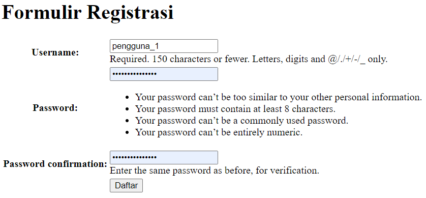
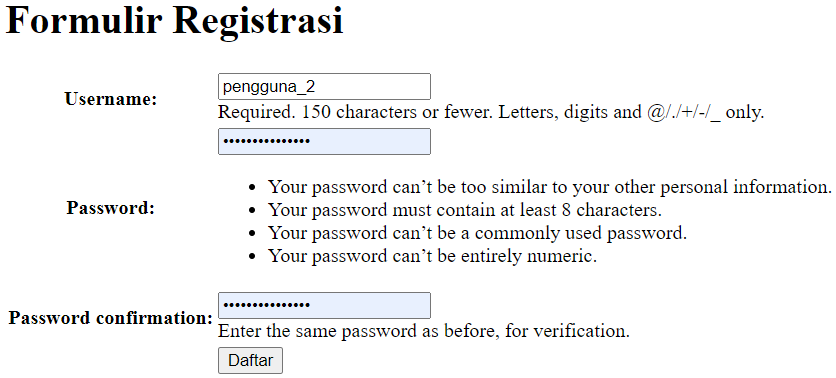
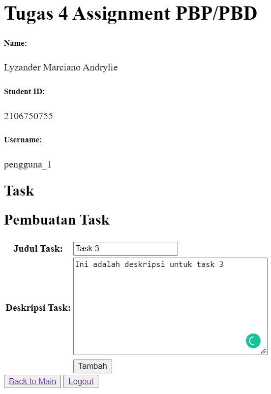
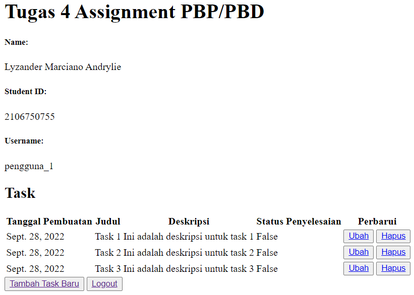
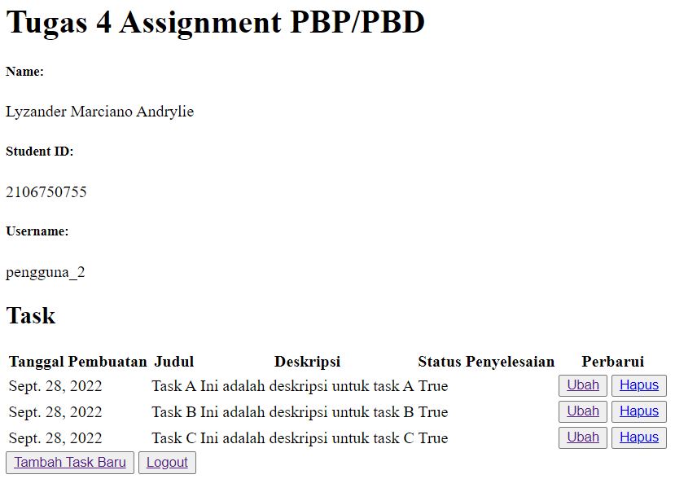

# Aplikasi Todolist Django
:link: [Aplikasi Todolist](https://django-tugas-2-lyz.herokuapp.com/todolist)

## Fungsi `` pada Elemen `<form>`
Fungsi `` pada Elemen `<form>` adalah untuk memproteksi terhadap `Cross Site Request Forgery` sehingga POST request yang dilakukan dari user ke server terjamin aman. Hal ini dilakukan oleh Django dengan menghasilkan token pada sisi server ketika halaman web di-*render* dan token ini akan dicek untuk *request* yang datang kembali dari user. 

`Cross Site Request Forgery` adalah ancaman yang menyebabkan user yang telah terautentikasi melakukan aksi yang tidak diharapkan untuk dilakukan pada suatu web aplikasi. Penyerang akan memanfaatkan user yang telah terautentikasi dengan memodifikasi *request* user tersebut.

Untuk mencegah hal tersebut, Django memiliki *built-in protection* terhadap sebagian besar tipe dari serangan `Cross Site Request Forgery` tersebut. Proteksi ini teraktivasi secara *default* pada `MIDDLEWARE` setting di `settings.py`.<br>

### Apa yang Terjadi Apabila Tidak Ada Potongan Kode Tersebut pada Elemen `<form>`?
Django akan menghasilkan HTTP *response* dengan kode status 403 yang berarti *Forbidden*. Hal ini dikarenakan verifikasi CSRF gagal karena CSRF token *missing* sehingga *request* dari user akan langsung di-*abort*. Selain itu, hal ini terjadi karena mekanisme CSRF Django tidak digunakan dengan baik, yaitu untuk setiap *tempate* yang menggunakan POST form, kita harus menggunakan `csrf_token` tag di dalam `<form>` element.

***

## Pembuatan Elemen `<form>` secara Manual
Kita sebenarnya dapat membuat elemen `<form>` secara manual, tanpa menggunakan *generator* seperti `{{ form.as_table }}`. Namun, sesuai dengan prinsip DRY (Dont' repeat yourself) pada Django, kita dapat memanfaatkan fitur tersebut untuk membuat form pada Django.<br>

### Gambaran Umum Cara Pembuatan `<form>` Secara Manual
Pembuatan `<form>` secara manual dapat dilakukan dengan memanfaatkan elemen-elemen pada `HTML` seperti elemen `<input>`, `<textfield>`, dan input element lainnya dengan berbagai `attribute` yang tersedia pada elemen tersebut. Hal ini memungkinkan user/pengguna untuk mengisi, memilih, memanipulasi, dan mengirimkan informasi kembali ke server. 

```html
...
<!-- contoh pembuatan form hanya dengan elemen HTML -->
<form method="POST">
    <label for="judul_task">Judul Task:</label><br>
    <input type="text" id="judul_task"><br>
</form>
...
```

```html
<!-- contoh pembuatan form dengan django template language secara manual -->
<form method="POST">
    
    <label for="{{ form.judul_task.id_for_label }}">Judul Task :</label>
    {{ form.judul_task }}

    {{ form.deskripsi_task.label_tag }}
    {{ form.deskripsi_task }}

</form>
```

> Perhatikan bahwa penggunaan `form` sesuai dengan variabel yang terdapat di `context` dan *field* pada form, seperti `judul_task` dan `deskripsi_task`, sesuai dengan yang didefinisikan pada `forms.py`

***

## Proses Alur Data
1. Submisi data yang dilakukan pengguna<br>
Submisi data yang dilakukan oleh pengguna melalui HTML form akan dicek terlebih dahulu apakah valid atau tidak dengan menggunakan `form.is_valid()`. Setelah data yang dicek valid, data-data yang di-*submit* oleh pengguna akan disimpan pada *attribute* `cleaned_data` milik `form`, yaitu `form.cleaned_data`. Selain itu, data juga akan disimpan dalam objek `request` dalam *attribute* POST berbentuk `QueryDict`.

2. Penyimpanan data pada database<br>
Kemudian, kita bisa menyimpan data tersebut dalam *database* dengan memanfaatkan metode `form.save()` dengan syarat form harus merupakan *subclass* dari `ModelForm`. Hal ini dikarenakan metode tersebut akan membuat dan menyimpan objek dari data yang terikat dengan form. Jika tidak, kita dapat membuat *instance* secara manual dari model dengan *keyword argument* yang sesuai dan menyimpan objek dari model tersebut ke database dengan metode save(), yaitu `instance_model.save()`. Hal ini bertujuan agar model yang kita buat dapat disimpan dalam *database* dengan melakukan *SQL statement* berupa *INSERT*.

3. Munculnya data yang telah disimpan pada *template* HTML<br>
Terakhir, untuk menampilkan data yang telah disimpan pada *template* HTML, kita tinggal memanfaatkan *Django Template Language*. Selain itu, pada fungsi yang telah kita definisikan pada `views.py`, kita harus memanggil fungsi *query* ke *model database* dan menyimpan hasil *query* di dalam variabel `context` yang akan ikut di-*render* oleh Django ketika me-*render* *template* tersebut.

***

## Implementasi
1. Pembuatan Aplikasi `todolist`<br>
Kita dapat membuat suatu aplikasi baru berupa `todolist` di Django dengan menggunakan perintah berupa
    ```
    py manage.py startapp todolist
    ```
    atau

    ```
    django-admin startapp todolist
    ```

    Kemudian, kita harus mendaftarkan aplikasi `todolist` ke dalam proyek Django kita. Hal ini dilakukan dengan menambahkan `'todolist'` ke dalam variabel `INSTALLED_APPS` pada `settings.py` pada folder `project_django`

    ```python
    INSTALLED_APPS = [
    ...,
    'mywatchlist',
    ]
    ``` 

2. Penambahan path `todolist`<br>
Penambahan path bertujuan agar pengguna bisa mengakses https://django-tugas-2-lyz.herokuapp.com/todolist/. Implementasi dilakukan dengan menambahkan `path('todolist/', include('todolist.urls')),` pada variable `urlpatterns` pada `urls.py` pada folder `project_django`.

    ```python
    from django.contrib import admin
    from django.urls import path, include

    urlpatterns = [
        ...,
        path('todolist/', include('todolist.urls')),
    ]
    ```

3. Pembuatan model `Task`<br>
Pembuatan model dilakukan dengan mendefinisikan suatu `class` bernama `Task` pada `models.py` pada folder `todolist`. `Class` tersebut merupakan *subclass* dari `django.db.models.Model`. Kemudian, pada class tersebut, kita mendefinisikan attribut yang merepresentasikan *database field*. Implementasi kode berupa

    ```python
    from django.db import models
    from django.contrib.auth.models import User


    # Create your models here.
    class Task(models.Model):
        user = models.ForeignKey(User, on_delete=models.CASCADE)
        date = models.DateField()
        title = models.CharField(max_length=50)
        description = models.TextField()
        # field untuk bonus
        is_finished = models.BooleanField(default=False)
    ```

    > Perhatikan bahwa masing-masing *attribute*, yaitu `user, date, title, dan description` memiliki *field type* yang berbeda-beda (sesuai dengan ketentuan dari masing-masing *attribute* tersebut)

    Ketentuan mengenai masing-masing *attribute* berupa
    - `user` untuk menghubungkan *task* dengan pengguna yang membuat *task* tersebut. Implementasi dilakukan dengan memanfaatkan `models.ForeignKey()` untuk menghubungkan *atribute* `Task` dengan model lain, yaitu `django.contrib.auth.models.User`. Hal ini diperlukan agar pengguna hanya dapat melihat *task* yang dibuat oleh pengguna itu sendiri.
    - `date` untuk mendeskripsikan tanggal pembuatan *task*
    - `title` untuk mendeskripsikan judul *task*.
    - `description` untuk mendeskripsikan deskripsi *task*.

    Selain itu, kita harus melakukan perintah `python manage.py makemigrations` untuk mempersiapkan migrasi skema model dan `python manage.py migrate` untuk menerapkan skema model yang telah dibuat ke dalam *database* Django lokal.

4. Implementasi form registrasi, login, dan logout<br>
Implementasi form registrasi dilakukan dengan memasukkan kode berikut pada `views.py` pada folder `todolist`

    ```python
    from django.shortcuts import redirect
    from django.contrib.auth.forms import UserCreationForm
    from django.contrib import messages

    def register(request):
    form = UserCreationForm()

    if request.method == "POST":
        form = UserCreationForm(request.POST)
        if form.is_valid():
            form.save()
            messages.success(request, 'Akun telah berhasil dibuat!')
            return redirect('todolist:login')
    
    context = {'form':form}
    return render(request, 'register.html', context)
    ```

    Selain itu, kita harus mempersiapkan *template* `register.html` yang akan digunakan dengan implementasi sebagai berikut.

    ```html
    

    
    <title>Registrasi Akun</title>
    

      

    <div class = "login">
        
        <h1>Formulir Registrasi</h1>  

            <form method="POST" >  
                  
                <table>  
                    {{ form.as_table }}  
                    <tr>  
                        <td></td>
                        <td><input type="submit" name="submit" value="Daftar"/></td>  
                    </tr>  
                </table>  
            </form>

          
            <ul>   
                  
                    <li>{{ message }}</li>  
                      
            </ul>   
        

    </div>  

    
    ```
    Implementasi form login dilakukan dengan memasukkan kode berikut pada `views.py` pada folder `todolist`

    ```python
    from django.contrib.auth import authenticate, login

    def login_user(request):
    if request.method == 'POST':
        username = request.POST.get('username')
        password = request.POST.get('password')
        user = authenticate(request, username=username, password=password)
        if user is not None:
            login(request, user)
            return redirect('todolist:show_todolist')
        else:
            messages.info(request, 'Username atau Password salah!')
    context = {}
    return render(request, 'login.html', context)
    ```
    Selain itu, kita harus mempersiapkan *template* `login.html` yang akan digunakan dengan implementasi sebagai berikut.

    ```html
    

    
    <title>Login</title>
    

    

    <div class = "login">

        <h1>Login</h1>

        <form method="POST" action="">
            
            <table>
                <tr>
                    <td>Username: </td>
                    <td><input type="text" name="username" placeholder="Username" class="form-control"></td>
                </tr>

                <tr>
                    <td>Password: </td>
                    <td><input type="password" name="password" placeholder="Password" class="form-control"></td>
                </tr>

                <tr>
                    <td></td>
                    <td><input class="btn login_btn" type="submit" value="Login"></td>
                </tr>
            </table>
        </form>

        
            <ul>
                
                    <li>{{ message }}</li>
                
            </ul>
             

        Belum mempunyai akun? <a href="">Buat Akun</a>

    </div>

    
    ```

    Terakhir, Implementasi logout dilakukan dengan membuat fungsi
    berikut pada `views.py` pada folder `todolist`

    ```python
    from django.contrib.auth import logout

    def logout_user(request):
        logout(request)
        return redirect('todolist:login')
    ```


5. Pembuatan halaman utama `todolist`<br>
Implementasi dilakuan dengan membuat fungsi pada `views.py` pada folder `todolist` berupa
    ```python
    from django.contrib.auth.decorators import login_required
    from todolist.models import Task

    @login_required(login_url='/todolist/login/')
    def show_todolist(request):
        user = request.user
        username = ""

        # Pengecekan user
        if user.is_authenticated:
            username = user.username

        data_task = Task.objects.filter(user=user)
        
        context = {
            'data_task': data_task,
            'nama_user': username,
            'nama': 'Lyzander Marciano Andrylie',
            'id': '2106750755'
        }
        return render(request, 'todolist.html', context)
    ```

    > Perhatikan bahwa restriksi dilakukan agar halaman utama todolist hanya dapat diakses oleh user yang terautentikasi. Implementasi dilakukan dengan menambahkan kode ` @login_required(login_url='/todolist/login/')` di atas fungsi `show_todolist`.

    Kemudian, kita harus mempersiapakan *template* berupa `todolist.html` untuk ditampilkan ke pengguna yang telah login. Implementasi sebagai berikut dan terdapat tombol `Tambah Task Baru`, tombol *logout*, serta tabel berisi tanggal pembuatan *task*, judul *task*, dan deskripsi *task*
    ```html
    

    

    <h1>Tugas 4 Assignment PBP/PBD</h1>

    <h5>Name: </h5>
    <p>{{nama}}</p>

    <h5>Student ID: </h5>
    <p>{{id}}</p>

    <h5>Username: </h5>
    <p>{{nama_user}}</p>

    <h2>Task</h2>
    <table>
    <tr>
        <th>Tanggal Pembuatan</th>
        <th>Judul</th>
        <th>Deskripsi</th>
        <!-- Bonus -->
        <th>Status Penyelesaian</th>
        <th>Perbarui</th>
    </tr>
     Add the data below this line 
    
        <tr>
        <td>{{task.date}}</td>
        <td>{{task.title}}</td>
        <td>{{task.description}}</td>

        <!-- Bonus -->
        <td>{{task.is_finished}}</td>
        <td>
            <button><a href="">Ubah</a></button>
            <button><a href="">Hapus</a></button>
        </td>
        </tr>
    
    </table>

    <button><a href="">Tambah Task Baru</a></button>
    <button><a href="">Logout</a></button>

    
    ```

6. Pembuatan halaman form untuk pembuatan *task*<br>
Pembuatan form dilakukan dengan mendefinisikan suatu `class` bernama `TaskForm` berserta *attribute*-nya yang merepresentasikan *field* pada `forms.py` pada folder `todolist`. `Class` tersebut merupakan *subclass* dari `django.forms.Form`. Implementasi dilakukan dengan membuat `forms.py` pada folder `todolist` sebagai berikut.
    ```python
    from django import forms

    class TaskForm(forms.Form):
        judul_task = forms.CharField(max_length=50, label="Judul Task", required=True)
        deskripsi_task = forms.CharField(max_length=200, label="Deskripsi Task", required=True, widget=forms.Textarea)
    ```

    Kemudian, kita mendefinisikan fungsi pada `views.py` pada folder `todolist` sebagai berikut.

    ```python
    def create_task(request):
    form = TaskForm()

    if request.method == 'POST':
        form = TaskForm(request.POST)

        if form.is_valid():

            # Pembuatan objek dari model Task
            user = request.user
            date = datetime.datetime.now()

            data = form.cleaned_data
            title = data['judul_task']
            description = data['deskripsi_task']

            # Simpan objek dari model Task ke database
            task = Task(user=user, date=date, title=title, description=description)
            task.save()

            return redirect('todolist:show_todolist')

    # Pengecekan user
    user = request.user
    username = ""

    if user.is_authenticated:
        username = user.username

    context = {
        'nama_user': username,
        'nama': 'Lyzander Marciano Andrylie',
        'id': '2106750755',
        'form': form
    }

    return render(request, "create_task.html", context)
    ```
    > statement `data = form.cleaned_data` berfungsi untuk menyimpan data-data yang telah divalidasi pada form setelah pengecekan `form.is_valid()`.

    Kemudian, kita harus mempersiapakan *template* berupa `create_task.html` untuk ditampilkan ke pengguna yang ingin membuat task baru. Implementasi sebagai berikut
    ```html
    

    

    <h1>Tugas 4 Assignment PBP/PBD</h1>

    <h5>Name: </h5>
    <p>{{nama}}</p>

    <h5>Student ID: </h5>
    <p>{{id}}</p>

    <h5>Username: </h5>
    <p>{{nama_user}}</p>

    <h2>Task</h2>

    <div class = "task">

        <h2>Pembuatan Task</h2>  

            <form method="POST">  
                  
                <table>  
                    {{ form.as_table }}  
                    <tr>  
                        <td></td>
                        <td><input type="submit" name="submit" value="Tambah"/></td>  
                    </tr>  
                </table>  
            </form>

          
            <ul>   
                  
                    <li>{{ message }}</li>  
                      
            </ul>   
        

    </div>

    <button><a href="">Back to Main</a></button>
    <button><a href="">Logout</a></button>

    
    ```

7. Pembuatan *routing*<br>
Tujuan pembuatan *routing* adalah agar halaman untuk login, register, halaman utama, dan halaman pembuatan task dapat diakses melalui URL yang sesuai. Hal ini dilakukan dengan menambahkan `path()` ke dalam variabel `urlpatterns` pada `urls.py` pada folder `todolist`. Penambahan sebagai berikut.

    ```python
    app_name = 'todolist'

    urlpatterns = [
        path('', show_todolist, name='show_todolist'),
        path('update/<int:id>', update_task, name='update_task'),
        path('delete/<int:id>', delete_task, name='delete_task'),
        path('register/', register, name='register'),
        path('login/', login_user, name='login'),
        path('logout/', logout_user, name='logout'),
        path('create-task', create_task, name='create_task')
    ]
    ```

8. *Deployment* ke Heroku terhadap aplikasi `todolist`<br>
*Deployment* bertujuan agar aplikasi `todolist` dapat diakses melalui internet. Kita akan memanfaatkan *runner* dari GitHub Actions dan Heroku sebagai *host* dari aplikasi yang akan kita *deploy*.

    Perhatikan bahwa proses *deployment* telah dilakukan pada tugas sebelumnya, yaitu tugas 2. Hal ini dilakukan dengan membuat aplikasi pada Heroku dan menambahkan *repository secret* pada repositori proyek Django di Github. Oleh karena itu, untuk tugas ini, kita tinggal mengakses melalui laman https://django-tugas-2-lyz.herokuapp.com/todolist

9. Pembuatan 2 akun pengguna dan 3 data model `Task`<br>
Pembuatan akun pengguna dilakukan dengan mendaftar terlebih dahulu pada http://django-tugas-2-lyz.herokuapp.com/todolist/register/. Selanjutnya, pengguna yang telah terdaftar tinggal login dan klik tambah task baru untuk membuat tiga buah task baru.

    ### Register Pengguna 1
    

    ***

    ### Register Pengguna 2
    
        
    ***

    ### Tambah Task Pengguna 1
    
        
    ***

    ### Task Pengguna 1
    
        
    ***

    ### Task Pengguna 2
    

***

## Inline, Internal, dan External CSS
1. Inline CSS<br>
Inline CSS adalah suatu cara untuk menambahkan *style* pada HTML kita dengan memanfaatkan `style` *attribute* yang disediakan oleh HTML. Inline CSS memungkinkan kita untuk menambahkan suatu *style* secara langsung ke HTML elements dan biasanya digunakan untuk menerapkan suatu ***style* unik** pada suatu elemen tertentu saja 
    > jika kita ingin menerapkan suatu *style* pada beberapa elemen sekaligus, kita dapat memanfaatkan `Internal CSS` atau `External CSS`.

    Sintaks berupa
    ```html
    <element style="property:value; property:value"> </element>
    ```

2. Internal CSS<br>
Internal CSS adalah suatu cara untuk menambahkan *style* pada HTML kita dengan memanfaatkan `<style>` element dan mendefinisikan CSS Rule di dalam `<style>` element tersebut. 

    Sintaks berupa
    ```html
    <head>
        <style>
            selector {
                property: value;
                property: value;
                ...
            }
        </style>
    </head>
    ```
    > Cara ini akan bermanfaat ketika kita ingin menambahkan *style* unik ke halaman tunggal pada *website* kita.

3. External CSS<br>
External CSS adalah suatu cara untuk  menambahkan *style* pada HTML kita dengan membuat *file* terpisah untuk CSS dan menghubungkan dengan HTML kita. Penghubungan dilakukan dengan memanfaatkan `<link>` element dan meletakkannya pada `<head>` element pada HTML file kita.

    Sintaks berupa
    ```html
    <!-- index.html -->

    <head>
        <link rel="stylesheet" href="styles.css">
    </head>
    ```
    ```css
    /* styles.css */

    selector {
        property: value;
        property: value;
        ...
    }
    ```

### Perbedaan Inline, Internal, dan External CSS
| Inline CSS | Internal CSS | External CSS |
| --- | ----------- | --- |
| *style* ditulis secara langsung ke dalam *opening tag* suatu HTML element dengan memanfaatkan atribut berupa `style:""` | pendefinisian *style* terletak pada `<head>` element pada suatu HTML dengan memanfaatkan `<style>` element | pendefinisian *style* dilakukan pada file yang terpisah dan dihubungkan dengan html menggunakan `<link>` element |
| biasanya diterapkan untuk element tunggal tertentu saja dengan style unik | biasanya diterpakan untuk beberapa element pada file yang sama | biasanya diterapkan untuk beberapa element pada file yang berbeda |
| menggunakan atribut style | menggunakan `<style>` element | menggunakan `<link>` element untuk menghubungkan dengan file css eksternal
| memiliki specificity CSS declaration tertinggi | specificity CSS declaration ditentukan oleh selector | specificity CSS declaration ditentukan oleh selector |

### Kelebihan dan Kekurangan
1. Inline CSS<br>
- Kelebihan: 
    - Memiliki *specificity* paling tinggi sehingga dapat meng-*override* *style* yang dideklarasikan pada internal ataupun external CSS (Perhatikan bahwa hal ini bisa jadi kekurangan juga)
    - Bisa menerapkan suatu style pada suatu HTML element tunggal secara cepat
- Kekurangan:
    - Sulit untuk menerapkan *style* yang sama ke beberapa elemen yang berbeda. Hal ini dikarenakan kita harus melakukan `copy` dan `paste` berulang kali
    - Kode pada HTML kita akan menjadi sulit untuk dibaca ketika terdapat banyak deklarasi CSS pada beberapa element tunggal

2. Internal CSS<br>
- Kelebihan:
    - Bisa menerapkan *style* unik pada halaman tertentu pada *website* kita
- Kekurangan:
    - Size dari HTML file kita bisa membesar ketika terdapat banyaknya deklarasi CSS rule

2. External CSS<br>
- Kelebihan:
    - Menjaga file HTML dan CSS terpisah sehingga memudahkan untuk melakukan *maintenance* 
    - Size dari file HTML akan lebih kecil dibandingkan dengan menggunakan internal CSS
    - file HTML akan terlihat lebih *bersih*
- Kelemahan:
    - Perubahan yang kita lakukan pada suatu CSS rule tertentu dapat memengaruhi beberapa halaman HTML yang memanfaatkan rule tersebut
    - Halaman web kita mungkin tidak di-*render* dengan baik sebelum external CSS di-*load*

Sumber: https://www.theodinproject.com/lessons/foundations-css-foundations


***

## Tag HTML5
- `<html>` = merepresentasikan root element dari HTML document
- `<head>` = mengandung metadata tentang dokumen HTML tersebut
- `<title>` = digunakan untuk mendefinisikan judul dokumen yang akan ditampilkan pada tab di browser kita
- `<meta>` = digunakan untuk merepresentasikan metadata yang tidak dapat direpresentasikan oleh HTML meta-related elements lainnya.
- `<body>` = digunakan untuk merepresentasikan konten dari suatu HTML document
- `<p>` = digunakan untuk merepresentasikan paragraf
- `<h1>`= digunakan untuk merepresentasikan *section heading*
- `` = digunakan untuk merepresentasikan gambar
- `<style>` = mengandung informasi berkaitan dengan style untuk dokumen HMTL kita
- `<link>` = digunakan untuk menspesifikkan hubungan antara *current* document dengan *external sources*
- `<a href="">` = digunakan untuk membuat hyperlink ke berbagai *source* yang bisa diakses oleh suatu URL

Sumber: https://developer.mozilla.org/en-US/
***

## Tipe-Tipe CSS Selector
1. Universal Selector<br>
Universal selector akan memilih dan menerapkan style ke semua tipe elemen. Sintaks berupa
```css
* {
    property: value;
}
```

2. Type/Element Selector<br>
Type/element selector akan memilih dan menerapkan style ke tipe elemen yang sesuai dengan selector. Sintaks berupa
```css
element {
    property: value;
}
```

3. Class Selector<br>
Class selector akan memilih dan menerapkan style ke elemen dengan class yang sesuai dengan selector. Sintaks berupa
```css
.nama-class {
    property: value;
}
```

4. ID Selector<br>
ID selector akan memilih dan menerapkan style ke elemen dengan ID yang sesuai dengan selector. Sintaks berupa
```css
#nama-id {
    property: value;
}
```

## Implementasi CSS pada aplikasi todolist
1. Kustomisasi templat HTML dengan CSS<br>
Kustomisasi templat HTML dilakukan dengan memanfaatkan CSS framework, yaitu Bootstrap. Penambahan Bootstrap pada aplikasi todolist dilakukan dengan menambahkan barisan kode berikut pada templat `base.html`.
    ```html
    <link href="https://cdn.jsdelivr.net/npm/bootstrap@5.2.2/dist/css/bootstrap.min.css" rel="stylesheet" integrity="sha384-Zenh87qX5JnK2Jl0vWa8Ck2rdkQ2Bzep5IDxbcnCeuOxjzrPF/et3URy9Bv1WTRi" crossorigin="anonymous">
    ```
    > Perhatikan bahwa potongan kode di atas digunakan untuk memanfaatkan CDN Bootstrap

2. Kustomisasi templat untuk halaman login, register, dan create-task<br>
Kustomisasi templat untuk halaman login dilakukan dengan memanfaatkan class CSS yang telah terdefinisi pada Bootstrap untuk berbagai elemen dan juga fitur-fitur untuk spacing, flex, color, container, navbar, dll.

3. Kustomisasi halaman utama todo list menggunakan cards<br>
Kustomisasi halaman utama todo list menggunakan card sehingga masing-masing card mengandung satu task dilakukan dengan memanfaatkan elemen `<div>` dan CSS class `.card`. Implementasi sebagai berikut.
    ```html
    <div class="container-fluid d-flex flex-wrap justify-content-center">
         Add the data below this line 
        
        
        <div class="card text-bg-success m-3 done" style="width: 18rem;">
        <div class="card-body">
            <h5 class="card-title">{{task.title}}</h5>
            <h6 class="card-subtitle mb-2">{{task.date}}</h6>
            <h6 class="card-subtitle mb-2">Selesai</h6>
            <p class="card-text">{{task.description}}</p>
            <button class="btn btn-primary"><a href="" class="link-light">Ubah</a></button>
            <button class="btn btn-secondary"><a href="" class="link-light">Hapus</a></button>
        </div>
        </div>
        
        <div class="card text-bg-danger m-3 undone" style="width: 18rem;">
        <div class="card-body">
            <h5 class="card-title">{{task.title}}</h5>
            <h6 class="card-subtitle mb-2">{{task.date}}</h6>
            <h6 class="card-subtitle mb-2">Belum Selesai</h6>
            <p class="card-text">{{task.description}}</p>
            <button class="btn btn-primary"><a href="" class="link-light">Ubah</a></button>
            <button class="btn btn-secondary"><a href="" class="link-light">Hapus</a></button>
        </div>
        </div>

        
        
    </div>
    ```

    > Implementasi di atas juga memanfaatkan Django template language sehingga kita tidak pelu membuat hal yang sama berulang kali. 

4. Halaman yang dikustomisasi menjadi responsive<br>
Perhatikan bahwa *class-class* yang terdefinisi pada Bootstrap sudah *responsive* *by default* dan memanfaatkan *media queries* dengan baik sehingga kita tidak perlu mengimplementasi kembali (`Don't reinvent the wheel`).
